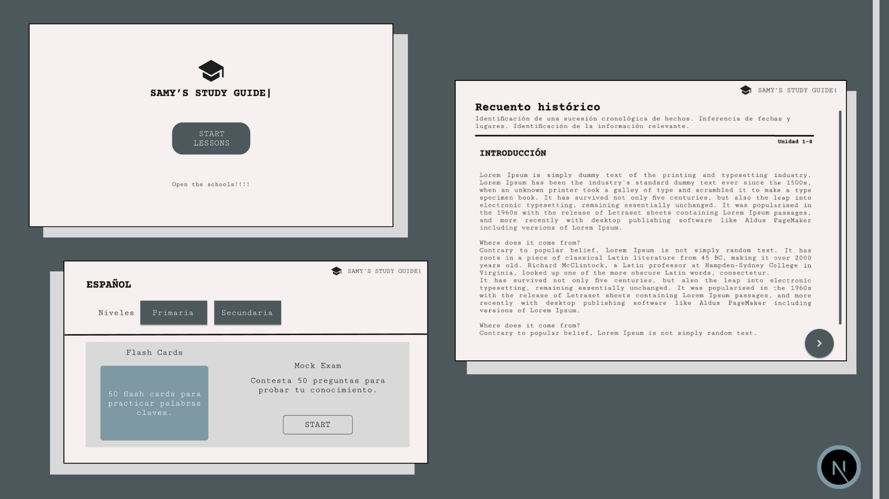

# Samy's Study Guide

"Samy's Study Guide" is an educational platform designed to help students prepare for a general knowledge university entrance exam. The website will provide structured educational content, interactive exercises, and practice exams with immediate feedback.




## Technologies

- **Frontend**: 
  - Next.js 15.2.3
  - React 19
  - TypeScript
  - TailwindCSS 4.0.14
  - DnD Kit (for drag and drop functionality)

## Project Structure

```
src/
├── app/          # Application components and pages
├── core/         # Business logic and models
├── infrastructure/ # External configurations and services
├── lib/          # Utilities and helpers
├── ui/           # Reusable UI components
└── styles/       # Global styles and CSS configurations
```

## Installation

1. Clone the repository:
```bash
git clone git@github.com:NatalyBarroso/SamyStudyGuide.git
cd samys-study-guide
```

2. Install dependencies:
```bash
npm install
```

3. Start the development server:
```bash
npm run dev
```

## Available Scripts

- `npm run dev`: Starts the development server with Turbopack
- `npm run build`: Builds the application for production
- `npm run start`: Starts the production server
- `npm run lint`: Runs the linter to check the code


## Development

The project uses:
- ESLint for linting
- TypeScript for static typing
- PostCSS and TailwindCSS for styling
- Turbopack for fast development

## Contributors

We welcome contributions from the community! Here's how you can help:

1. Fork the repository
2. Create your feature branch (`git checkout -b feature/AmazingFeature`)
3. Commit your changes (`git commit -m 'Add some AmazingFeature'`)
4. Push to the branch (`git push origin feature/AmazingFeature`)
5. Open a Pull Request

### Current Contributors

- [Nataly Barroso](https://github.com/NatalyBarroso) - Project Creator & Lead Developer


## Visit the website (demo)
You can try the platform here: [https://sammysstudyguide.netlify.app]


## Contact
Created by [Nataly Barroso](mailto:barrosonataly.dev@gmail.com.com) – feel free to reach out!


## License

[MIT](LICENSE)
